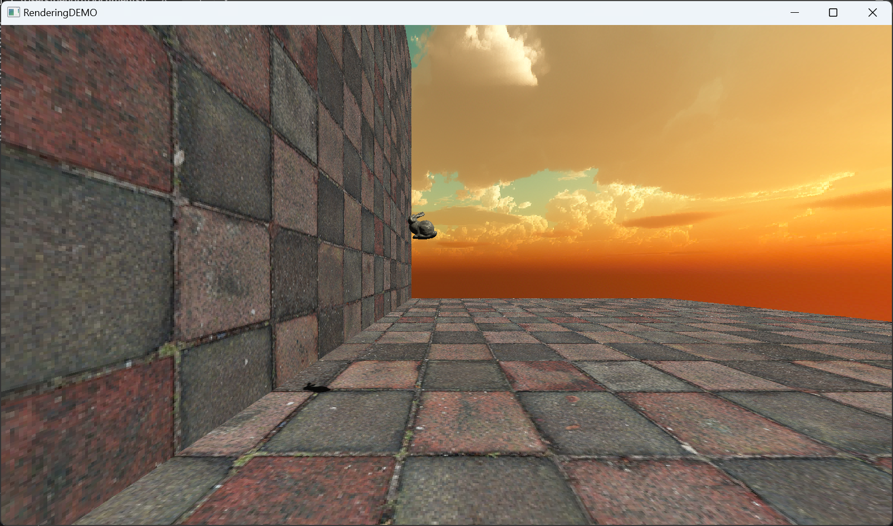

# RenderingDEMO

## Outline
This is a simple game engine I make. For now, it can support OpenGL and DirectX11 only on Windows.



## How to use
First, clone the repository. Remember to add ```--recursive``` at the end of your ```git clone``` command because this project contains submodules.

### Windows
#### Method 1
Open the root folder with Visual Studio and run the cmake file 
#### Method 2
```
$ mkdir build
$ cd build
$ cmake ..
```
Then run the .sln file.

## Finished 
- basic RHI 
- basic 3D rendering camera system
- basic render pass
- basic forward rendering
- phong lighting
- simple shadow mapping
- skybox
- 3D graphics math library
- smiple resource loader
- simple 3D rigid body physics (both traditional and shape matching)

## Notice

### Physics Engine
For now, this part in my engine is just a very simple one and need to be reconstructed in the future. No good collision detection. No good intergration with other systems. Bad performance. Only support dynamic rigid body collided with static planes.

Bunny in the front is force based while bunny in the back is position based.

[some notes about physics engine](./doc/blog.md)

## TODO list

### Priority
- Reconstruct math library
- Add smiple scene manager (ECS)
- Add basic editor (imgui)
- Add batch rendering

### In the future
- Add smiple scripting system (Lua)
- Add multi-thread (logic thread and render thread)
- Add rendering features (PBR, Deferred Rendering...)
- Add cross compiling (cmake presets)

## References

### Rendering API
[Learn OpenGL](https://learnopengl.com/Getting-started/OpenGL)

[Learn D3D11](https://graphicsprogramming.github.io/learnd3d11/1-introduction/1-1-getting-started/1-1-0-overview/)

### Game Engine Framework
[Unreal Engine](https://github.com/folgerwang/UnrealEngine)

[Piccolo](https://github.com/BoomingTech/Piccolo)

[Hazel](https://github.com/TheCherno/Hazel)

### Physics Engine Framework
[Jolt Physics](https://github.com/jrouwe/JoltPhysics)

[PhysX](https://github.com/NVIDIA-Omniverse/PhysX)