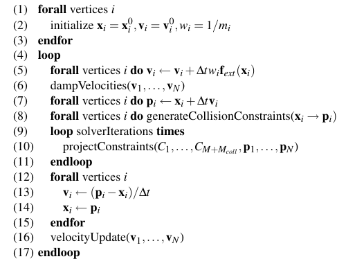

## Framework of Physics Engine
Simulation normally contains four stages.

BoardPhase -> NarrowPhase -> ResolvePhase -> Intergration

BoardPhase: BVH or spatial hash

## Position Based Dynamics

velocityUpdate is used for updating the velocities of collided points.
